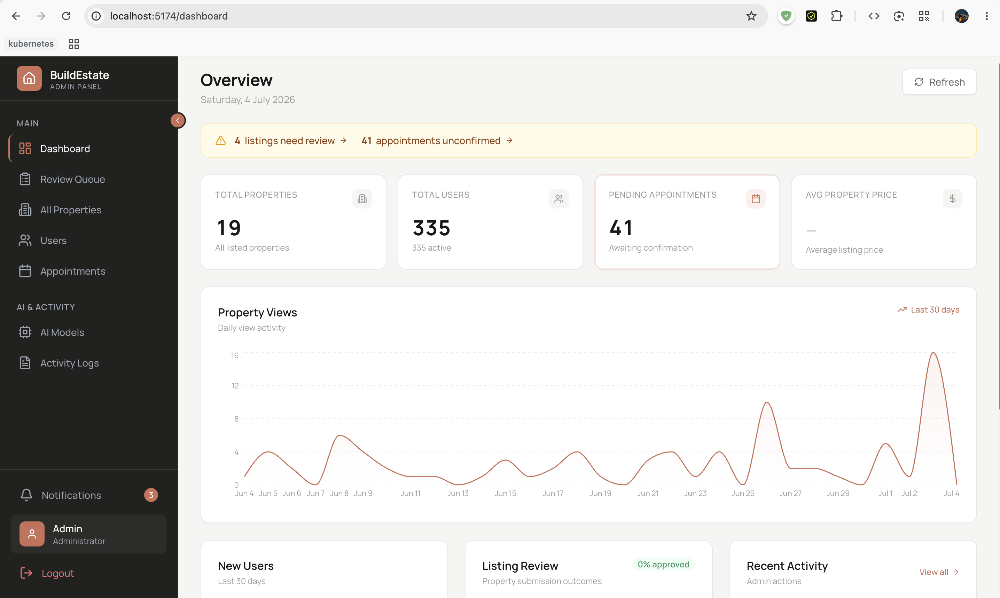

<div align="center">

# BuildEstate — Admin Panel 📊

_The control room of BuildEstate — review listings, manage users & appointments, and monitor the platform._

[](https://react.dev)
[](https://vitejs.dev/)
[](https://tailwindcss.com)

[](https://real-estate-website-admin.onrender.com/)
[](https://aayush-vaghela.vercel.app/)

</div>

---

## 📸 Preview

<div align="center">
  
</div>

---

## ✨ Key Features

- **Dashboard Analytics** — KPI cards, property-views and user-growth charts (Recharts), review-queue status, and a live admin activity timeline.
- **Review Queue** — Approve or reject user-submitted property listings, with a full image gallery and lightbox for checking photos.
- **Property Management** — Add, update, and delete properties with multi-image upload (up to 4 images per property via ImageKit).
- **User Management** — View all users, inspect a user's details and listings, suspend / ban / reactivate accounts (single or bulk).
- **Appointment Management** — Approve, cancel, or attach meeting links to property-viewing requests.
- **AI Model Management** — Enable/disable the AI models used by the AI Property Hub and pick the default one.
- **Activity Logs** — Every admin action is recorded and searchable for a full audit trail.

---

## 💻 Tech Stack

| Domain                         | Technology Implementation |
| ------------------------------ | ------------------------- |
| **Framework Ecosystem**        | React 18 + Vite 6         |
| **User Interface Composition** | Tailwind CSS v3           |
| **Statistical Visualization**  | Recharts                  |
| **Vector Elements**            | Lucide React              |
| **Notification Operations**    | Sonner                    |
| **Network Requests**           | Axios                     |

---

## 🚀 Quick Start Setup

<details>
<summary><strong>1. Environment Initialization</strong></summary>

```bash
cd admin
npm install
cp .env.example .env.local
```

</details>

<details>
<summary><strong>2. Defining Network Mapping</strong></summary>

Update `admin/.env.local` to point explicitly toward your operational backend URI:

```env
VITE_BACKEND_URL=http://localhost:4000
```

</details>

<details>
<summary><strong>3. Execute Local UI Interface</strong></summary>

```bash
npm run dev
```

Admin workspace is provisioned at **http://localhost:5174**

</details>

---

## 🗺️ Interface Architecture

| Panel View     | Route               | Core Purpose                                           |
| -------------- | ------------------- | ------------------------------------------------------ |
| Login          | `/login`            | Admin authentication                                    |
| Dashboard      | `/dashboard`        | KPIs, traffic & user-growth charts, activity timeline   |
| Review Queue   | `/pending-listings` | Approve / reject user-submitted property listings       |
| All Properties | `/list`             | Manage the full property catalog                        |
| Users          | `/users`            | User management — suspend, ban, reactivate, details     |
| Appointments   | `/appointments`     | Viewing requests — status updates & meeting links       |
| AI Models      | `/ai-models`        | Configure the models used by the AI Property Hub        |
| Activity Logs  | `/activity-logs`    | Audit trail of every admin action                       |
| Add Property   | `/add`              | Create a new property listing                           |
| Update         | `/update/:id`       | Edit an existing property                               |

---

## 📂 Component Layout

<details>
<summary><strong>Explore the Working Tree</strong></summary>

```text
admin/src/
├── components/  # Sidebar, ProtectedRoute, modals (suspend/ban), shared UI
├── config/      # Constants (backend URL, property types, amenities)
├── contexts/    # AuthContext — admin JWT state
├── services/    # apiClient — Axios with token refresh on 401
├── pages/
│   ├── Dashboard.jsx        # KPIs + Recharts analytics
│   ├── PendingListings.jsx  # Review queue with image gallery
│   ├── List.jsx             # All properties
│   ├── Users.jsx            # User management
│   ├── UserDetails.jsx      # Single user drill-down
│   ├── Appointments.jsx     # Viewing requests
│   ├── AIModels.jsx         # AI model configuration
│   ├── ActivityLogs.jsx     # Admin audit trail
│   ├── Add.jsx              # New property form
│   └── Update.jsx           # Edit property
└── App.jsx      # Router
```

</details>

---

## 🌐 System Deployment

**Render Static Deployments:**

1. Stage finalized logic to the master repository line.
2. Initialize **Static Site Service** on Render mapping root architecture.
3. Validate **Root Directory** specifically inside `admin`.
4. Trigger build via: `npm install && npm run build`.
5. Define distribution as `dist` routing payload.
6. Verify deployment by linking `VITE_BACKEND_URL` strictly to operational Express servers.

Currently resolving at: **https://real-estate-website-admin.onrender.com**

---

<div align="center">

**Associated Applications**

[Frontend README](../frontend/README.md) • [Backend README](../backend/README.md) • [Root Interface](../README.md)

_Maintained by [Aayush Vaghela](https://aayush-vaghela.vercel.app/)_

</div>
