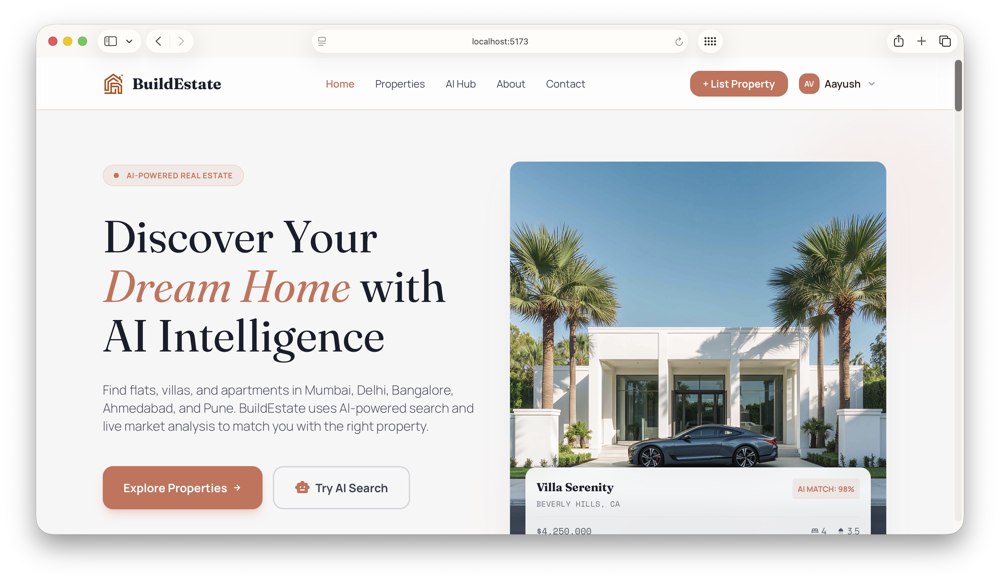
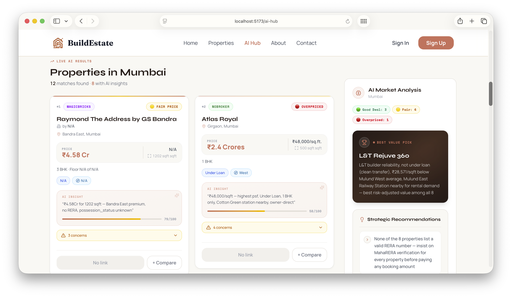
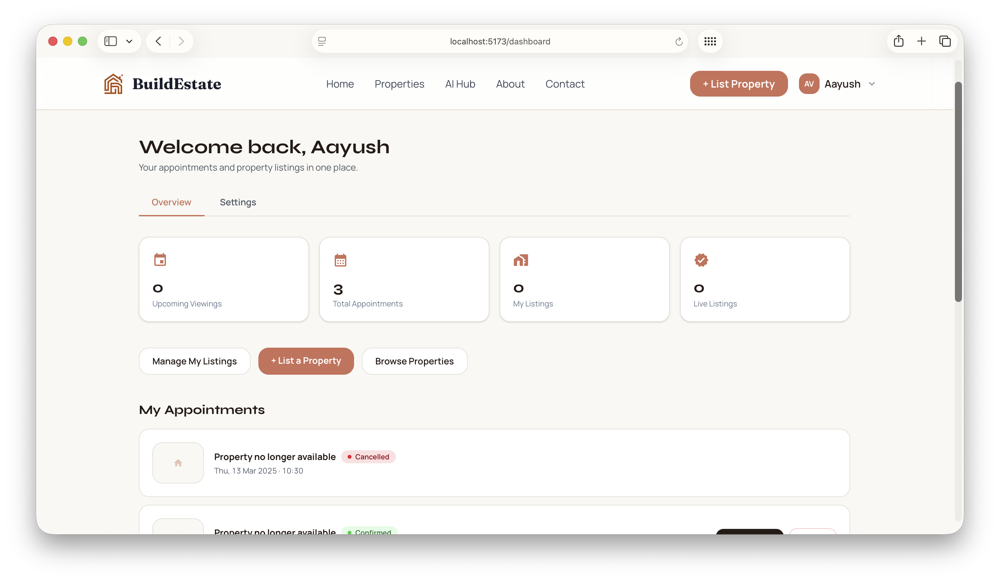

<div align="center">

# BuildEstate — Frontend 🌐

_The user-facing website of BuildEstate — browse & list properties, book viewings, and search live listings with AI._

[](https://react.dev)
[](https://www.typescriptlang.org)
[](https://vitejs.dev/)
[](https://tailwindcss.com)

[](https://buildestate.vercel.app)
[](https://aayush-vaghela.vercel.app/)

</div>

---

## 📸 Preview

<div align="center">
  
  <br/><br/>
  
  &nbsp;&nbsp;
  
</div>

---

## ✨ Features

- **Property Browsing** — Filter by type, price, availability, and amenities with interactive grid/list views.
- **Property Details** — Comprehensive image gallery, amenities list, and integrated appointment booking.
- **User Authentication** — Secure sign up, log in, email verification, and password recovery.
- **User Dashboard & Listings** — Registered users can list their own property for sale/rent and track its review status.
- **Appointment Booking** — Schedule property viewings as a guest or authenticated user.
- **AI Property Hub** — Search live listings scraped from 99acres, MagicBricks & NoBroker; AI ranks results with match scores, value verdicts, and red flags. Model is selectable (GLM, Nemotron & more); you only need a free Firecrawl key.
- **Location Trends** — AI-analyzed price per sq.ft, rental yields, and appreciation outlook per locality.
- **SEO Optimized** — Built-in structured data generation, sitemap mapping, `robots.txt`, and per-page meta tags.
- **Page Transitions** — Fluid UI animations powered by Framer Motion.

---

## 💻 Tech Stack

| Category             | Technology                       |
| -------------------- | -------------------------------- |
| **Framework**        | React 18.3 + TypeScript + Vite 6 |
| **Styling**          | Tailwind CSS v4 + PostCSS        |
| **State Management** | React Context API                |
| **Routing**          | React Router v7                  |
| **HTTP Client**      | Axios                            |
| **Animations**       | Framer Motion                    |
| **Icons**            | Lucide React                     |

---

## 🚀 Quick Start

<details>
<summary><strong>1. Installation & Setup</strong></summary>

```bash
cd frontend
npm install
cp .env.example .env.local
```

Edit the `.env.local` file to include your connection parameters.

</details>

<details>
<summary><strong>2. Configure Environment Variables</strong></summary>

Create or edit `frontend/.env.local`:

```env
# Required — points to your backend API
VITE_API_BASE_URL=http://localhost:4000

# Optional — set to "true" to enable AI Property Hub locally
VITE_ENABLE_AI_HUB=true
```

> **Note:** Do not set `VITE_ENABLE_AI_HUB` on Vercel. Leaving it unset disables the aggressive AI Hub fetching on the live site (saving API credits) and presents a localized "run locally" modal instead.

</details>

<details>
<summary><strong>3. Run the Development Server</strong></summary>

```bash
npm run dev
```

Frontend runs at **http://localhost:5173**

</details>

---

## 🗺️ Page Routing

| Page            | Route                | Description                                                |
| --------------- | -------------------- | ---------------------------------------------------------- |
| Home            | `/`                  | Hero section, featured properties, about snippets          |
| Properties      | `/properties`        | Browse catalog with robust interactive filters             |
| Property Detail | `/property/:id`      | Full multimedia details and booking capabilities           |
| AI Property Hub | `/ai-hub`            | Live-scraped AI search with model selector (local env only)|
| User Dashboard  | `/dashboard`         | Personal dashboard — stats, listings, appointments         |
| My Listings     | `/my-listings`       | Manage your submitted property listings                    |
| Add Property    | `/add-property`      | List your own property for sale/rent                       |
| About           | `/about`             | Team overview and company information                      |
| Contact         | `/contact`           | User contact form submission                               |
| Sign In         | `/signin`            | Authenticate user                                          |
| Sign Up         | `/signup`            | Register new user                                          |
| Forgot Password | `/forgot-password`   | Password reset request pipeline                            |
| Reset Password  | `/reset/:token`      | Set a new password from the emailed link                   |
| Verify Email    | `/verify-email/:token` | Email verification after registration                    |

---

## 📂 Project Structure

<details>
<summary><strong>Explore Directory Tree</strong></summary>

```text
frontend/src/
├── components/
│   ├── ai-hub/           → AI Property Hub functional components
│   ├── common/           → Universal elements (Navbar, Footer, SEO, PageTransition)
│   ├── home/             → Modular Homepage sections
│   ├── properties/       → Filter sidebar, property cards, catalog layouts
│   ├── property-details/ → Multimedia gallery, amenities parser, booking form
│   ├── about/            → About page subsections
│   └── contact/          → Contact interface
├── contexts/             → Global React Context (e.g., AuthContext)
├── hooks/                → Custom React utilities (e.g., useSEO)
├── pages/                → Complete route components (Lazy-loaded)
├── services/             → Centralized network interface (`api.ts` Axios wrapper)
└── styles/               → Global CSS and Tailwind configurations
```

</details>

---

## 📜 Available Scripts

| Script            | Action                                                     |
| ----------------- | ---------------------------------------------------------- |
| `npm run dev`     | Launch Vite development server with hot module replacement |
| `npm run build`   | Compile robust production-ready bundle                     |
| `npm run preview` | Serve and preview the compiled production build locally    |
| `npm run lint`    | Execute ESLint for code formatting and standard reviews    |

---

## 🌐 Deployment Pipeline

**Vercel Production Deployments:**

1. Push your latest branch to GitHub.
2. Import the repository into [Vercel](https://vercel.com).
3. Set **Root Directory** to `frontend`.
4. Inject environment variable: `VITE_API_BASE_URL` mapped to your Render backend URL.
5. **Critically:** Do not set `VITE_ENABLE_AI_HUB` in Vercel to preserve limits.
6. Trigger Deploy.

Currently live at: **https://buildestate.vercel.app**

---

<div align="center">

**Associated Applications**

[Backend README](../backend/README.md) • [Admin Panel README](../admin/README.md) • [Root Interface](../README.md)

_Built by [Aayush Vaghela](https://aayush-vaghela.vercel.app/)_

</div>
